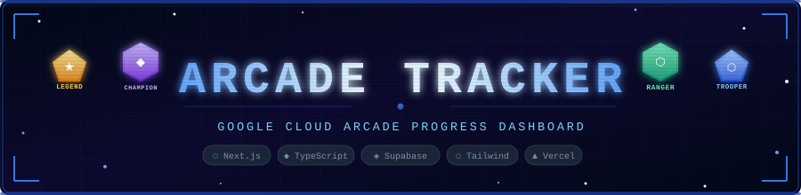

<p align="center">
  

<p align="center">
  
  
  
  
  
  
  
</p>

---

# 🎮 ArcadeTracker
A web dashboard for monitoring the progress of Google Cloud Arcade participants featuring real-time point tracking, a tier system, and a comprehensive catalog of skill badges

Paste your public Skills Boost profile URL and immediately see:
- **Arcade Points** game badges (+1) and skill badges (+0.5) for the active period
- **Tier Eligibility** Trooper (50+) → Ranger (75+) → Champion (95+) → Legend (120+)
- **Facilitator Milestones** M1 (+5 pts), M2 (+15 pts), Ultimate (+25 pts) progress bars
- **Active July 2026 Tracks** the six monthly game tracks with completion status
- **FastTrack Catalog** 50+ skill badges searchable by name, difficulty, and category
- **Live Leaderboard** real-time with a podium and full rankings

## ✨ Key Features

### 🧑‍💻 Player Dashboard
- **Automatic Point Summary** Automatic calculation: Game Badge (×1 pt) + Skill Badge (×0.5 pt) + Facilitator Milestone Bonus
- **Tier System** Legend (120+), Champion (95+), Ranger (75+), Trooper (50+) with a progress bar to the next tier
- **Milestone Tracker** M1 / M2 / M3 / Ultimate Milestone with extra bonus points
- **Active Game Tracks** 6 Arcade tracks complete with access codes
- **Fast Track Catalog** 50+ GCAF 2026 skill badges that can be filtered by category, difficulty level, and completion status
- **Badge History** “My Badges” tab displaying all earned badges, with current/archive filters and an activity heatmap
- **Activity Chart** 
Visual breakdown of badge earnings over time

### 👩‍🏫 Facilitator Panel
- **Member Management** View and manage all participants associated with a facilitator code
- **CSV Import** Bulk-upload participant data via CSV with validation, per-row status feedback, and rollback support
- **Email Sending** Send targeted emails to selected participants directly from the dashboard
- **Batch History** Full log of every CSV import with rollback option for any batch
- **Real-Time Sync** Member list updates instantly via **Supabase Realtime** subscriptions

### 🛠️ Admin Panel
- **Global Statistics** Live counts: total participants, total badges, game badges, skill badges, active facilitators
- **Participant Overview** Lists of recently synced and unsynced participants with direct profile links
- **Facilitator Code Management** Add and delete facilitator codes with name labels
- **Master Sync** Trigger a bulk synchronization of all participant data to the Arcade sheet
- **Maintenance Mode** Toggle site-wide maintenance mode on/off with a single click
- **Audit Log** Paginated, timestamped log of all admin actions with actor, target, and metadata
- **Feedback Management** View and manage player feedback submissions with ratings and categories

## 🎯 Point System & Levels

### Point Calculation

```
Total Points = Game Badges × 1 pt
           + Skill Badges × 0.5 pt
           + Facilitator Bonus (from achievement milestones)
```

### Milestones & Bonuses

| Milestone | Game Badges | Skill Badges | Point Bonus |
|---|---|---|---|
| Milestone 1 | 1 | 7 | +5 points |
| Milestone 2 | 3 | 14 | +15 points |
| Achievement Milestone 3 | 8 | 28 | +25 points |
| Highest Achievement Milestone | 12 | 42 | +40 points |

### Levels

| Tier | Min. Points | Level |
|---|---|---|
| Legend | 120+ |1|
| Champion | 95+ |2|
| Explorer | 75+ |3|
|  Warrior | 50+ |4|


## 🚀 How to Run

### Prerequisites
- Node.js 18+
- pnpm / npm / yarn
- Supabase account (the free tier is sufficient)
### Installation Steps

```bash
# 1. Clone the repository
git clone https://github.com/RakkaEvandra06/ArcadeTracker.git

# 2. Navigate to the project folder
cd ArcadeTracker

# 3. Install dependencies
npm install

# 4. Run the development server
npm run dev
```

> **Common error — `column facilitator_members.fac_code does not exist` (Postgres 42703)**
> This means the `facilitator_members` table was created without the `fac_code` column.
> Fix it by running the ALTER TABLE block at the bottom of `schema.sql` in the Supabase SQL Editor.

## 🏗️ Project Structure
 
```
ArcadeTracker/
├── src/
│   ├── app/
│   │   ├── admin/                     # Admin panel page
│   │   ├── admin-login/               # Admin login page
│   │   ├── facilitator/               # Facilitator dashboard page
│   │   ├── facilitator-login/         # Facilitator login page
│   │   ├── player-login/              # Player login page (Skills Boost URL input)
│   │   ├── dashboard/                 # Player dashboard page
│   │   ├── api/
│   │   │   ├── auth/
│   │   │   │   ├── login/             # POST — authenticate & create session cookie
│   │   │   │   ├── logout/            # POST — destroy session (rate-limited)
│   │   │   │   └── me/                # GET  — validate active session
│   │   │   ├── participants/
│   │   │   │   ├── route.ts           # GET  — list all participants (leaderboard)
│   │   │   │   └── [id]/route.ts      # GET/PUT/DELETE — single participant CRUD
│   │   │   ├── scrape/route.ts        # POST — scrape Skills Boost profile via Cheerio
│   │   │   ├── skills/route.ts        # GET  — list all GCAF skill badges
│   │   │   ├── feedback/route.ts      # POST — submit player feedback
│   │   │   ├── facilitator/
│   │   │   │   ├── batches/           # GET/POST — CSV import batch management
│   │   │   │   ├── email/             # POST — send emails to selected members
│   │   │   │   ├── import/            # POST — bulk CSV participant import
│   │   │   │   └── members/           # GET/POST/DELETE — facilitator member management
│   │   │   ├── admin/
│   │   │   │   ├── stats/             # GET  — global statistics
│   │   │   │   ├── facilitators/      # GET/POST/DELETE — facilitator code management
│   │   │   │   ├── audit-logs/        # GET  — paginated audit trail
│   │   │   │   ├── master-sync/       # POST — bulk sync all participants
│   │   │   │   └── maintenance/       # POST — toggle maintenance mode
│   │   │   └── cron/
│   │   │       ├── sync-participants/ # Scheduled: sync all badge data (16:00 UTC)
│   │   │       └── refresh-leaderboard/ # Scheduled: rebuild rankings (16:30 UTC)
│   │   ├── globals.css                # Global styles & Tailwind design tokens
│   │   ├── layout.tsx                 # Root layout with metadata and providers
│   │   └── page.tsx                   # Root redirect (→ /player-login)
│   │
│   ├── components/
│   │   ├── Dashboard.tsx              # Player dashboard (Overview / Catalog / Badges tabs)
│   │   ├── DashboardSkeleton.tsx      # Loading skeleton for the player dashboard
│   │   ├── FacilitatorDashboard.tsx   # Facilitator dashboard (members, import, email, history)
│   │   ├── FacilitatorPanel.tsx       # Leaderboard panel for facilitators
│   │   ├── AdminPanel.tsx             # Full admin control panel
│   │   ├── ProfileHeader.tsx          # Participant avatar, name, tier badge, points
│   │   ├── ActivityChart.tsx          # Badge activity chart
│   │   ├── ActivityHeatmap.tsx        # 26-week calendar heatmap
│   │   ├── AccessCodeModal.tsx        # Modal for game track access codes
│   │   ├── Header.tsx                 # Navigation bar with theme toggle & language switcher
│   │   ├── PlayerShell.tsx            # Wrapper layout for player-facing pages
│   │   ├── PlayerDashboardClient.tsx  # Client-side state manager for player dashboard
│   │   ├── Providers.tsx              # Global context providers (theme, language)
│   │   ├── SignOutDialog.tsx          # Confirmation dialog for sign-out
│   │   └── Toast.tsx                  # Toast notification system
│   │
│   ├── lib/
│   │   ├── db.ts                      # Supabase client + all database query functions
│   │   ├── i18n.ts                    # Full internationalization string map
│   │   ├── LanguageContext.tsx        # React context for language switching
│   │   ├── localAuth.ts               # Local (admin) credential validation
│   │   ├── security.ts                # Rate limiting, CSRF, and input sanitization
│   │   ├── session.ts                 # HMAC session creation and verification
│   │   ├── session-constants.ts       # Cookie name and max-age constants (Edge-safe)
│   │   ├── supabase-client.ts         # Browser-side Supabase client (anon key)
│   │   └── useTheme.ts                # Dark/light theme hook with localStorage persistence
│   │
│   └── middleware.ts                  # Edge Middleware — role-based route protection
│
├── public/
│   ├── icon.png                       # App icon / favicon
│   ├── OpenGraph.png                  # Social share preview image
│   └── 500px.png                      # Additional image asset
│
├── .env.local                         # Local environment variables (never commit)
├── eslint.config.mjs                  # ESLint configuration
├── postcss.config.mjs                 # PostCSS config for Tailwind
├── tsconfig.json                      # TypeScript configuration
├── vercel.json                        # Vercel deployment + cron job config
├── package.json                       # Dependencies and npm scripts
└── LICENSE.txt                        # MIT License
```

## 🤝 Contributing
 
Contributions are welcome and appreciated! Here's how to get involved:
 
### Reporting Bugs
 
1. Search the [Issues](https://github.com/RakkaEvandra06/ArcadeTracker/issues) page to check if it's already reported
2. Open a new issue with the **Bug Report** template
3. Include: your OS, Node.js version, steps to reproduce, expected vs actual behavior, and any error messages
### Suggesting Features
 
1. Open a new issue with the **Feature Request** template
2. Describe the problem your idea solves and your proposed solution
3. Discuss the approach in the issue before opening a pull request

### Submitting a Pull Request
 
```bash
# 1. Fork the repository on GitHub
 
# 2. Clone your fork
git clone https://github.com/RakkaEvandra06/ArcadeTracker.git
cd ArcadeTracker
 
# 3. Create a feature branch
git checkout -b feature/your-feature-name
 
# 4. Install dependencies
npm install
 
# 5. Make your changes — keep commits focused and descriptive
 
# 6. Lint your code before committing
npm run lint
 
# 7. Push your branch
git push origin feature/your-feature-name
 
# 8. Open a Pull Request on GitHub against the main branch
```

### Contribution Guidelines
 
- Follow the existing TypeScript and Tailwind code style
- Keep pull requests focused one feature or bug fix per PR
- Add or update comments for any non-obvious logic
- Do not commit `.env.local` or any secrets
- Test your changes locally with `npm run dev` and `npm run build` before submitting

## 📬 Contact

Have a question, found a bug, or want to collaborate?
| Channel | Link |
|---|---|
| **GitHub** | [@RakkaEvandra06](https://github.com/RakkaEvandra06) |
| **Issues** | [ArcadeTracker Issues](https://github.com/RakkaEvandra06/ArcadeTracker/issues) |

Feel free to open a GitHub issue for any bug reports, feature requests, or general questions about the project.

## 📄 License
 
This project is licensed under the **MIT License**.
See [LICENSE.txt](LICENSE.txt) for the full license text.

<p align="center"> Made with ❤️ by <a href="https://github.com/RakkaEvandra06">RakkaEvandra06</a>, Google Cloud Arcade 2026 </p>